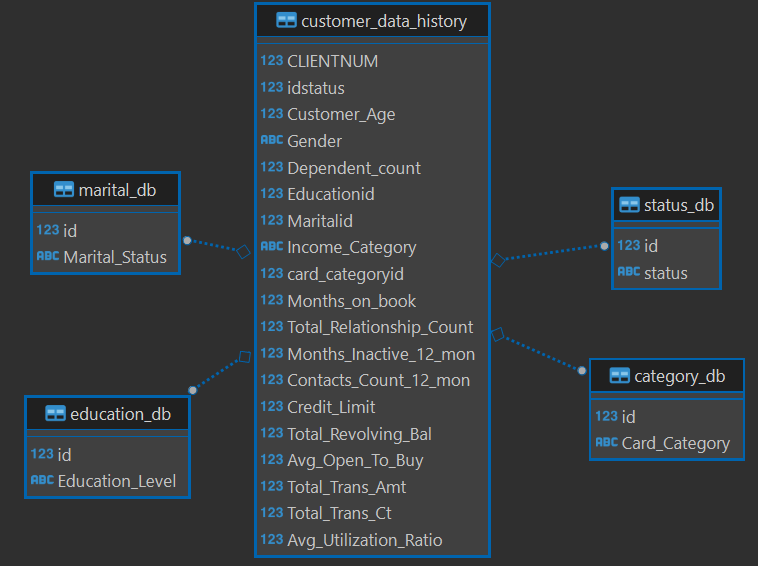
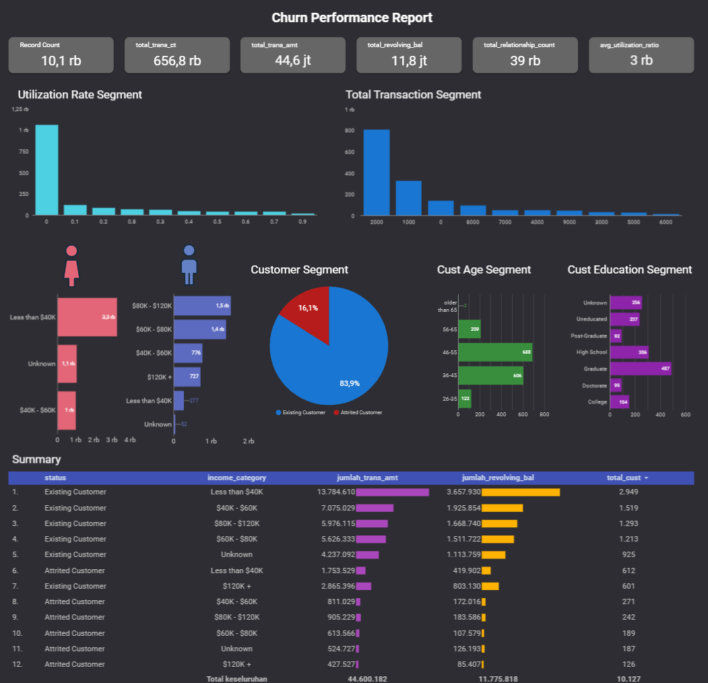

# BTPN Syariah : Customer Churn Segment

## Bussiness Understanding

Perusahaan finansial ini memiliki fokus utama pada penyediaan layanan perbankan digital dan produk asuransi. Meskipun telah mencapai pertumbuhan yang signifikan, perusahaan menghadapi tantangan customer churn yang dapat disebabkan oleh berbagai faktor, termasuk persaingan yang intens dan kebutuhan pelanggan yang terus berkembang. 

Pada tahun ini, kami mencatat peningkatan yang signifikan dalam pemutusan hubungan dengan beberapa segmen customer tertentu (churn). 

Untuk mengatasi permasalahan ini, perusahaan telah memilih pendekatan strategis dengan memanfaatkan tren segmentasi pelanggan. Dengan menganalisis perilaku dan preferensi pelanggan secara mendalam, perusahaan dapat menyesuaikan tawaran produk dan layanan mereka, memberikan pengalaman yang lebih personal dan memenuhi kebutuhan yang spesifik

## Goals

Sebagai Data Engineer x Analyst di BTPN Syariah, kami memiliki tanggung jawab untuk memberikan wawasan bisnis dan rekomendasi atas masalah saat ini guna meningkatkan kinerja perusahaan.

Mengoptimalkan proses profiling customer kredit untuk memastikan bahwa informasi yang terkumpul secara akurat mencerminkan kelayakan dan keandalan setiap pelanggan. serta mengembangkan strategi untuk menurunkan risiko kredit default dengan memanfaatkan data pelanggan secara efektif

## Schema dataset (ERD)

## Insights

Tingkat churn pelanggan saat ini 16% sebanyak 1627 customer, dan faktor utamanya adalah rendahnya penggunaan kartu kredit, sering kali nol transaksi. Hal ini disebabkan oleh

1. Kurangnya minat: Pelanggan tidak tertarik menggunakan kartu kredit untuk transaksi.
2. Biaya tinggi: Suku bunga layanan yang tinggi membuat pelanggan enggan menggunakan kartu kredit untuk transaksi besar.

#### Demografi
- Wanita dengan pendapatan $40,000 atau kurang berpotensi churn lebih tinggi.
- Pria dengan pendapatan lebih tinggi berpotensi churn lebih tinggi.
- Kelompok usia 36-55 berkontribusi paling besar terhadap churn.
- Pendidikan: Pelanggan dengan pendidikan "Graduate" paling banyak berhenti menggunakan kartu kredit.

## Rekomendasi
- Menawarkan program rewards, cashback, dan promo untuk mendorong transaksi kartu kredit, serta menyesuaikan penawaran dan layanan berdasarkan demografi dan perilaku pelanggan
- Meninjau dan menyesuaikan suku bunga layanan agar lebih kompetitif.
- Menjelaskan manfaat dan cara aman menggunakan kartu kredit untuk meningkatkan kepercayaan pelanggan.

